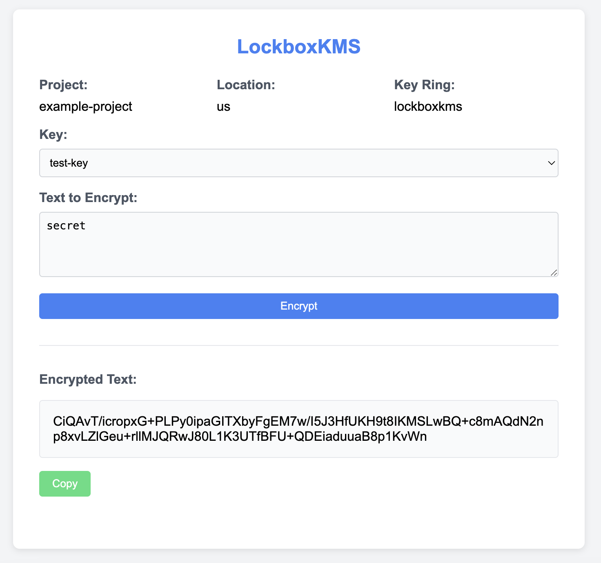

[](https://github.com/UnitVectorY-Labs/lockboxkms/releases/latest) [](https://opensource.org/licenses/MIT) [](https://guide.unitvectorylabs.com/bestpractices/status/#active) [](https://goreportcard.com/report/github.com/UnitVectorY-Labs/lockboxkms)

# lockboxkms

A simple web interface for encrypting text using Google Cloud KMS.

## Overview

`LockboxKMS` is a web application that provides a user-friendly interface to encrypt text data using Google Cloud Key Management Service (KMS). It supports multiple encryption keys and offers flexible key management, ensuring one-way data protection by focusing solely on encryption.

This application provides an extremely simple web interface for encrypting data using Google Cloud KMS providing the options for selecting a key in the KMS key ring and encrypting the data using that key.



The encrypted data is returned to the user base64 encoded, and can be decrypted using the same key in the KMS key ring, but this interface intentionally does not provide a decryption option.  The intent here is to provide a simple way to encrypt data using KMS, and then store the encrypted data somewhere so that a separate process can later use the same key to decrypt the data.

## Usage

The latest `lockboxkms` Docker image is available for deployment from GitHub Packages at [ghcr.io/unitvectory-labs/lockboxkms](https://github.com/UnitVectorY-Labs/lockboxkms/pkgs/container/lockboxkms).

## Configuration

The application is configurable through environment variables. Below are the available configurations:

- `GOOGLE_CLOUD_PROJECT`: Your Google Cloud project ID. (required, application will not start without it)
- `KMS_LOCATION`: The location of your KMS resources (default: us).
- `KMS_KEY_RING`: The name of the KMS key ring to use (default: lockboxkms).
- `GOOGLE_APPLICATION_CREDENTIALS`: (Optional) The path to your Google Cloud service account key file. If not provided, the application will use the default service account credentials which is recommended when deploying to GCP.
- `PORT`: The port on which the server listens (default: 8080).

## Permissions

The service account used by the application must have the following permissions that should be granted to the specific **key ring** to the service account used by `lockboxkms`:

- `roles/cloudkms.cryptoKeyEncrypter`
- `roles/cloudkms.viewer`

For example, these permissions can be granted using the following commands:

```bash
gcloud kms keyrings add-iam-policy-binding [KEYRING_NAME] \
    --location [LOCATION] \
    --member serviceAccount:[SERVICE_ACCOUNT_EMAIL] \
    --role roles/cloudkms.cryptoKeyEncrypter
gcloud kms keyrings add-iam-policy-binding [KEYRING_NAME] \
    --location [LOCATION] \
    --member serviceAccount:[SERVICE_ACCOUNT_EMAIL] \
    --role roles/cloudkms.viewer
```

For the app decrypting the `roles/cloudkms.cryptoKeyDecrypter` role should be granted on the specific **key** that will be used to decrypt the data.

## Limitations

- The application does not provide a decryption option. It is intended to be used for encrypting data only as the intended feature.
- This application does not provide any form of authentication or authorization. It is recommended to deploy this application behind a reverse proxy that provides authentication and authorization such as [Identity Aware Proxy](https://cloud.google.com/iap)
- KMS can encrypt data up to 64 KiB in size.
